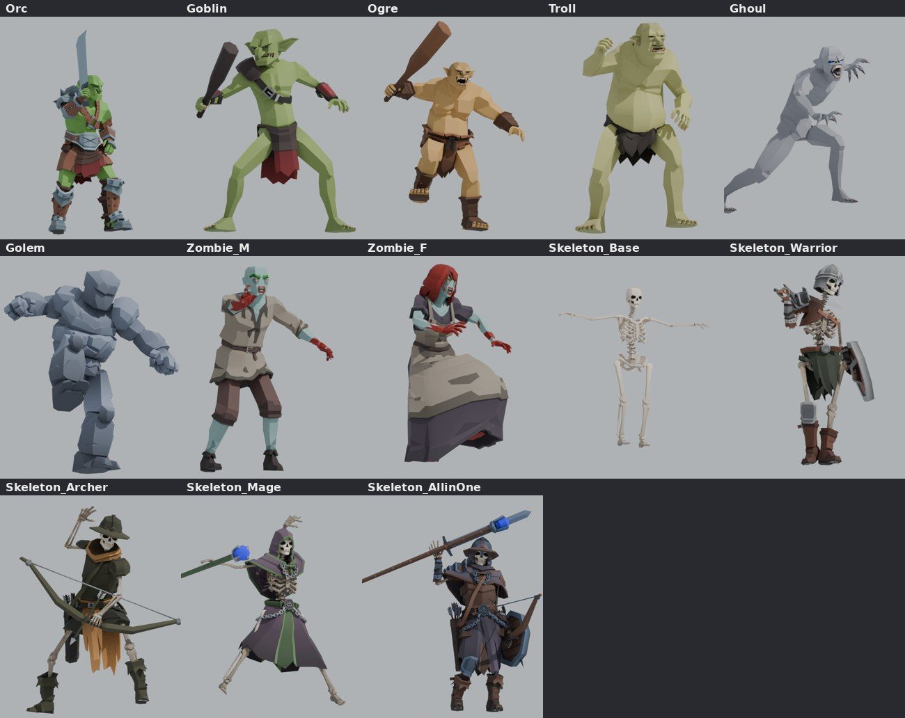
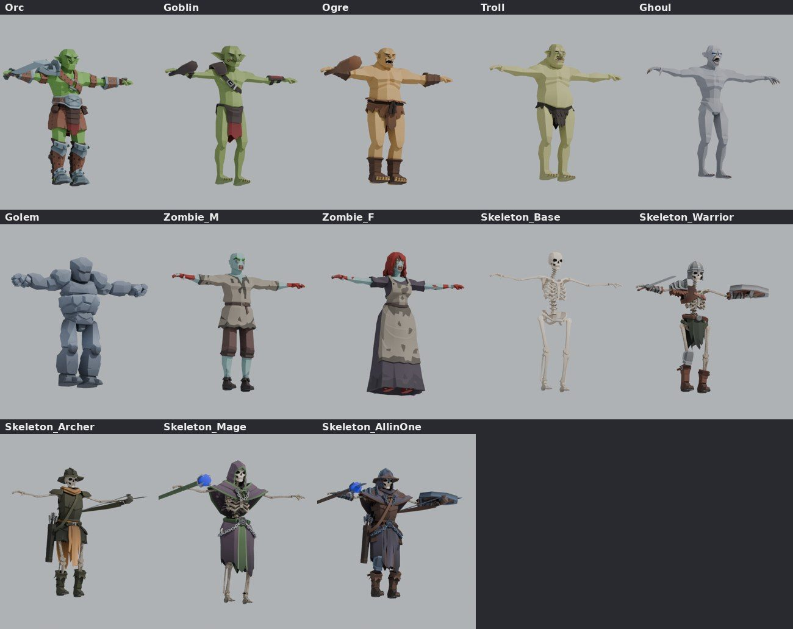
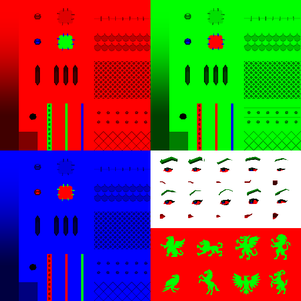
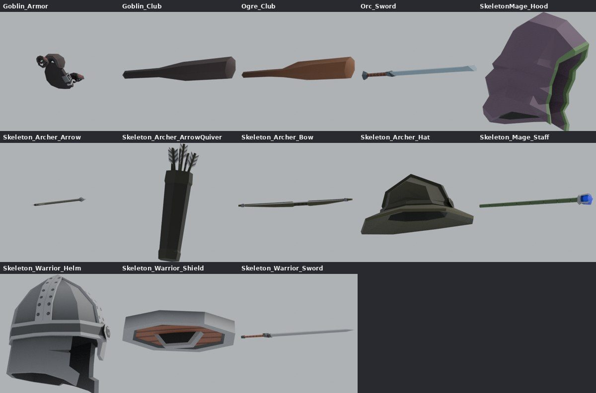

# Biped Creatures Pack — რა მოყვება და რა გვჭირდება

დოკუმენტი დაწერილია 2026-10-03-ს, პაკეტის ჩამოტვირთვისთანავე. ყველა რიცხვი
პაკეტის ფაილებიდანაა ამოღებული (FBX, Unity-ს `.meta`, `.mat`, `.prefab`,
`.controller`) და Blender-ით არის გადამოწმებული. შეფასება და რჩევა ცალკე
აბზაცებშია და ასეც არის მონიშნული.

- **პაკეტი:** „Low-Poly Medieval Fantasy – Biped Creatures Pack“ (Polysplit Games), $14.99.
  https://assetstore.unity.com/packages/3d/characters/creatures/low-poly-medieval-fantasy-biped-creatures-pack-340684
- **ლიცენზია:** Standard Unity Asset Store EULA. თამაშის ნაწილად გამოიყენება,
  ცალკე არ ვრცელდება.
- **გახსნილი პაკეტი:** `~/Projects/vepxis-art/packs/biped_creatures/` (ორიგინალი `.unitypackage` იქვეა, `packs/`-ში).
- **სად არის Mac-ზე:**
  `~/Library/Unity/Asset Store-5.x/Polysplit Games/3D ModelsCharactersCreatures/Low-Poly Medieval Fantasy - Biped Creatures Pack.unitypackage`
  (6.9 MB).
- **გახსნა Unity-ს გარეშე:** `.unitypackage` არის tar.gz. ყოველ GUID-საქაღალდეში
  არის `pathname` (ბილიკი) და `asset` (ფაილი). ხელით ასე გავხსენით:
  ```
  tar xzf pack.unitypackage
  for d in */; do p=$(head -1 "$d/pathname"); [ -f "$d/asset" ] && mkdir -p "x/$(dirname "$p")" && cp "$d/asset" "x/$p"; done
  ```



---

## 1. მოკლედ

| კითხვა | პასუხი |
| --- | --- |
| რამდენი არსებაა | **13 რიგიანი ფიგურა** (8 სახეობა + ჩონჩხების 5 ვარიანტი) და **13 გაუნძრევადი ქანდაკება**. |
| ჩონჩხი | **ყველას თავისი ჩონჩხი მოყვება, და ყველას ერთი და იგივეა:** Polysplit-ის 99 ძვლიანი `rootSkeleton`. ეს **ზუსტად** Heroes პაკეტის ჩონჩხია. 99-ვე ძვლის rest-პოზიცია ემთხვევა `BaseMale.fbx`-ს, განსხვავება 0.00000 მ. |
| Unity-ში | Humanoid avatar (`animationType: 3`). ყველა არსება ერთ avatar-ს იზიარებს: `Skeleton_AllinOne`-ისას. |
| ანიმაციები | **ანიმაცია არ მოყვება.** არის მხოლოდ 14 გაყინული პოზა (`StillPoses/BipedCreaturePoses.fbx`, თითო კადრი; ორკსა და გობლინს ორ-ორი) სადემონსტრაციო სცენისთვის. |
| იარაღები | 5 იარაღი და ფარი: ორკის ხმალი, გობლინის კეტი, ოგრის კეტი, ჩონჩხი-მეომრის ხმალი და ფარი, ჩონჩხი-მშვილდოსნის მშვილდი (თოკის ძვლით), ისარი და კაპარჭი, ჩონჩხი-ჯადოქრის კვერთხი. ამას ემატება 3 თავსაბურავი. ყველა ცალკე მეშია, მიბმული `R_equip_joint`-ზე ან `L_equip_joint`-ზე. |
| ტექსტურა | ერთი 2048² RGB-ნიღაბი (`genericRGB_medievalTexture.png`) და ფერები `.mat`-ებში (3 ფერი თითო მასალაზე). **წინასწარ შეღებილი PNG-ები, როგორიც Heroes-ს აქვს, ამ პაკეტს არ აქვს.** |
| Render pipeline | მხოლოდ URP. ჩვენთვის მნიშვნელობა არ აქვს: ვიღებთ FBX-ს, PNG-ს და ფერებს. |
| ზომა | ყველა T-პოზაში ≈ 2.0 მ სიმაღლისაა, რადგან ჩონჩხი ერთია. გობლინიც და ტროლიც ერთი სიმაღლისაა. სხვაობა თამაშში მასშტაბით უნდა შევქმნათ (§6). |
| FBX | Binary FBX 7.x, Blender-ის იმპორტერი 26-ვე ფაილს უპრობლემოდ კითხულობს (`M_Archer`-ის მსგავსი შეცდომა აქ არ არის). Armature-ს სკალა 0.01-ია (სანტიმეტრები). |

**ჩვენი ჩონჩხი არ გვჭირდება.** პაკეტს თავისი ჩონჩხი მოყვება, და ის
13-ვე არსებას ერთი აქვს, ამიტომ ვრჩებით მასზე (§5).

---

## 2. არსებები

ფაილები: `Assets/PolysplitGames/LowPolyMedievalFantasyBipedCreatures/BipedCreatures/<Name>.fbx`.
სამკუთხედები შეიცავს ყველა მეშს, იარაღის ჩათვლით.

| არსება | მეშები | სამკუთხ. | წვერო | იარაღი / აღჭურვილობა | პოზა (დემოში) |
| --- | --- | ---: | ---: | --- | --- |
| **Orc** | `Orc_Head`, `_Top`, `_Bottom`, `_Top_Armor`, `_Bottom_Armor`, `_Top_underArmor`, `_Bottom_underArmor`, `_Skirt`, `_Sword` | 6 363 | 3 488 | ხმალი (ფალჩიონი), ჯავშანი მხარზე, მკლავებზე და ფეხებზე | `OrcPoseB`: ხმალი მაღლა |
| **Goblin** | `Goblin_Body`, `_Armor`, `_LoinCloth`, `_Club` | 3 028 | 1 651 | კეტი, მხრის ღვედი, სამაჯურები | `GoblinPoseB`: კეტი მხარზე |
| **Ogre** | `Ogre_Body`, `_Skirt`, `_Wraps`, `_Club` | 3 470 | 1 862 | დიდი კეტი, ტყავის ქვედაბოლო, მაჯის შესახვევები | `OgrePose` |
| **Troll** | `Troll_Body`, `_CrotchFur` | 2 704 | 1 451 | ხელცარიელი, ბეწვის საფარი | `TrollPose` |
| **Ghoul** | `Ghoul` | 2 276 | 1 229 | ხელცარიელი, კლანჭებით | `GhoulPose`: მოხრილი, სირბილში |
| **Golem** | `Golem` | 2 100 | 1 136 | ხელცარიელი (ქვის მუშტები) | `GolemPose` |
| **Zombie_M** | `M_Zombie_Head`, `_Top`, `_Bottom` | 2 254 | 1 198 | ხელცარიელი, სისხლიანი ხელები | `M_ZombiePose` |
| **Zombie_F** | `F_Zombie_Head`, `_Hair`, `_Top`, `_Feet` | 3 700 | 1 930 | ხელცარიელი | `F_ZombiePose` |
| **Skeleton_Base** | `Skeleton_Head`, `_Top`, `_Bottom` | 4 224 | 2 352 | შიშველი ჩონჩხი | (პოზა არ აქვს, T-პოზა) |
| **Skeleton_Warrior** | Base + `Skeleton_Warrior_Top`, `_Bottom`, `_Helm`, `_Sword`, `_Shield` | 10 414 | 5 776 | ხმალი, ფარი, მუზარადი | `SkeletonWarriorPose` |
| **Skeleton_Archer** | Base + `Skeleton_Archer_Top`, `_Bottom`, `_Hat`, `_Strap`, `_Bow`, `_Arrow`, `_ArrowQuiver` | 9 358 | 5 321 | მშვილდი, ისარი, კაპარჭი, ქუდი | `SkeletonArcherPose`: მოზიდული მშვილდი |
| **Skeleton_Mage** | Base + `Skeleton_Mage_Top`, `_Bottom`, `_Staff`, `SkeletonMage_Hood` | 10 994 | 6 149 | კვერთხი (ლურჯი კრისტალით), კაპიუშონი | `SkeletonMagePose` |
| **Skeleton_AllinOne** | სამივე ჩონჩხის ყველა ნაწილი (19 მეში) | 22 318 | 12 542 | ყველაფერი ერთად, ასაწყობად | `SkeletonAllInOnePose` |



### ვარიანტები, რომლებიც ფაილებიდან ჩანს
- **ორკი ჯავშნით და ჯავშნის გარეშე.** ქანდაკებებში ორივეა: `Orc_prePosed` 3 764
  სამკუთხ., `Orc_armored_prePosed` 6 363 სამკუთხ. რიგიან ფიგურაზე ჯავშანი
  ცალკე მეშებია: `_Top_Armor`, `_Bottom_Armor`, `_Sword`. თუ მათ დავმალავთ,
  ჯავშნის გარეშე ორკი გამოვა.
- **გობლინი ჯავშნით და ჯავშნის გარეშე.** ასევე `Goblin_Armor` მეშის დამალვით
  (2 422 ↔ 3 028).
- **ჩონჩხები ასაწყობია.** `Skeleton_AllinOne`-ში სამივე ჩაცმულობაა, და
  `RGBRecolor_Objects_SkelUniform.mat`-ით ერთ „ფორმაში“ იღებება. ნაწილების
  ჩართვა-გამორთვით სხვადასხვა ჩონჩხს ავაწყობთ, მაგალითად მეომარს
  მშვილდოსნის ქუდით.
- **ჩონჩხები მძიმეა.** შიშველი ჩონჩხი 4.2k სამკუთხედია, ჩაცმული 9–11k. ეს
  დანარჩენებზე (2–3.5k) და Heroes-ზე (~3k) ბევრად მეტია. თუ ბანაკში 6+
  ჩონჩხი იქნება, LOD ან ტანსაცმლის ქვეშ დამალული ძვლების ამოჭრა დაგვჭირდება.

---

## 3. ჩონჩხი

ყველა რიგიან FBX-ს ერთი და იგივე 99 ძვლიანი ჩონჩხი აქვს, `rootSkeleton`:

```
pelvis_joint
├─ waist_joint ─ chest_joint
│   ├─ neck_joint ─ head_joint
│   │   ├─ hair_joint0..4, topPonytail_joint1..3, L_/R_Pigtail_joint1..3
│   │   └─ L_eyebrow_joint, R_eyebrow_joint, eyes_joint, mouth_joint
│   ├─ cape_joint1..6
│   ├─ bosom_joint
│   ├─ L_clavicle_joint ─ L_shoulder_joint ─ L_elbow_joint ─ L_wrist_joint
│   │   ├─ L_thumb/index/mid/ring/pinkyFinger_joint1..3
│   │   └─ L_equip_joint ─ BowRig ─ bowJoint ─ stringJoint
│   └─ R_clavicle_joint ─ R_shoulder_joint ─ R_elbow_joint ─ R_wrist_joint
│       ├─ R_thumb/index/mid/ring/pinkyFinger_joint1..3
│       └─ R_equip_joint
├─ L_thigh_joint ─ L_knee_joint ─ L_ankle_joint ─ L_ball_joint ─ L_toe_joint
├─ R_thigh_joint ─ … ─ R_toe_joint
└─ Back_/Front_coatTail1..4, L_/R_coatTail_joint1..4
```

- **ზუსტად Heroes-ის ჩონჩხია.** სახელებიც, იერარქიაც და rest-ის 99-ვე
  პოზიციაც ემთხვევა Heroes-ის `BaseCharacters/BaseMale.fbx`-ს, სხვაობა 0. ასე
  რომ, Heroes-ზე ნასწავლი ყველაფერი აქაც მუშაობს: `polysplit_map()`, თმისა და
  კაბის ჯაჭვები, `ps_creator.py`-ის ხაფანგები.
- **ერთ ძვალზე მიბმული მეშები:**
  - იარაღები: `R_equip_joint` (ხმალი, კეტები, კვერთხი) და `L_equip_joint` (ფარი);
  - მშვილდი: `bowJoint` და `stringJoint`;
  - ისარი: `stringJoint`;
  - კაპარჭი: `R_coatTail_joint1`;
  - მუზარადი და ქუდი: `head_joint`.

  იარაღის გამოცვლა ძვლის შვილობილი მეშის გამოცვლაა (`BoneAttachment3D`).
- **მშვილდს თავისი რიგი აქვს:** `L_equip_joint → BowRig → bowJoint → stringJoint`.
  `stringJoint` თოკის შუაა, ისარიც მასზეა მიბმული. თოკის მოზიდვა ამ ძვლის
  მარჯვენა ხელთან მიტანაა. ეს ის ამოცანაა, რაც ავთანდილის მშვილდისთვის
  `BowModifier`-ით უკვე გადავწყვიტეთ.
- **Unity-ს humanoid-ის რუკა** (`.meta`, `humanDescription`):

  | Unity | ძვალი |
  | --- | --- |
  | Hips | `pelvis_joint` |
  | Spine | `waist_joint` |
  | Chest | `chest_joint` |
  | Neck | `neck_joint` |
  | Head | `head_joint` |
  | Left/Right Shoulder | `L_/R_clavicle_joint` |
  | Left/Right UpperArm | `L_/R_shoulder_joint` |
  | Left/Right LowerArm | `L_/R_elbow_joint` |
  | Left/Right Hand | `L_/R_wrist_joint` |
  | Left/Right UpperLeg | `L_/R_thigh_joint` |
  | Left/Right LowerLeg | `L_/R_knee_joint` |
  | Left/Right Foot | `L_/R_ankle_joint` |
  | Left/Right Toes | `L_/R_ball_joint` |
  | თითები | `*Finger_joint1..3` (3 ფალანგა) |

  UpperChest არ აქვს, ხერხემალში 2 ძვალია. arm/leg twist 0.5-ია, translation DoF
  გამორთულია.
- **ზომები (rest, მეტრებში):**
  - მენჯი 1.05;
  - თავის ძვალი 1.76;
  - მაჯიდან მაჯამდე 1.67;
  - ბარძაყი 0.51, წვივი 0.42.

---

## 4. მასალა და ფერები

**ერთი ტექსტურა**, `Materials_Shaders_Textures/genericRGB_medievalTexture.png`,
2048², RGBA. ეს ნიღაბია: R, G და B არხები სამ ფერს აღნიშნავს, ბრტყელ სამ
ფერად. სიკაშკაშე ჩრდილის ზოლებს იძლევა. მარჯვენა ქვედა მეოთხედში თვალები,
წარბები და პირია, თავისი ფერებით, ალფა-ჭრით (cutout). ქვემოთ ჰერალდიკური
ნიშნებია.



**შეიდერი** `RGBRecolor_BipedCreatures.shadergraph` (URP Shader Graph):
`ფერი = R·Color1 + G·Color2 + B·Color3`. თვალის მართკუთხედში ცალკე ფერები
მოქმედებს: `EyeWhiteColor`, `CorneaColor`, `LipColor`. ასევე აქვს
`R/G/B_Smoothness` და `R/G/B_Metallic`, ალფა-ჭრა 0.5-ზე. FBX-ში ორი მასალაა:
`genericRGBMat_Body` და `genericRGBMat_Objects`. თითო არსებას თავისი წყვილი
`.mat` აქვს (FBX-ის `.meta` → `externalObjects`).

| არსება | Body: Color1 / 2 / 3 | Objects: Color1 / 2 / 3 |
| --- | --- | --- |
| Orc | `#70a74b` `#5e1f11` `#ffcf9e` | `#7a181d` `#794b37` `#879da8` |
| Goblin | `#859b54` `#5e1f11` `#ffcf9e` | `#882125` `#463533` `#9e9e9e` |
| Ogre | `#c79b59` `#5e1f11` `#ffcf9e` | `#855a32` `#885634` `#9e9e9e` |
| Troll | `#b2b06f` `#90775f` `#ffcf9e` | — |
| Ghoul | `#9c9da3` `#5e1f11` `#dcc1b4` (თვალი `#a0f6fd`) | — |
| Golem | `#939eb2` ×3 (ერთფეროვანი) | — |
| Zombie M/F | `#86a5a1` `#88180f` `#ffcf9e` | `#3e333f` `#583f3a` `#8b8070` |
| Skeleton (body) | `#e2d1bb` `#5e1f11` `#ffcf9e` | — |
| Skel. Warrior | ↑ | `#3b4530` `#925842` `#9e9e9e` |
| Skel. Archer | ↑ | `#e19d58` `#403f27` `#9e9e9e` |
| Skel. Mage | ↑ | `#624c5d` `#5f7d51` `#9e9e9e` (კრისტალი `#4c338d`) |
| Skel. AllinOne | ↑ | `#554b5d` `#604132` `#53627a` |

ფერები sRGB-შია, როგორც Unity-ს `.mat`-შია. Objects-ის B არხი ლითონია:
metallic 0.25, smoothness 0.25.

**რჩევა.** Godot-ში ორი გზაა:
1. **`rgb_recolor.gdshader`**: ერთი ShaderMaterial, uniform-ებით `color1..3`,
   `eye_white`, `cornea`, `lip`. ეს ერთი ხაზია: `ALBEDO = tex.r*c1 + tex.g*c2 + tex.b*c3`.
   სამაგიეროდ ბანაკის ვარიანტები უფასოა: წითელი ორკები, მკრთალი ზომბები და ა.შ.
   **ჩემი რჩევა ესაა.**
2. თითო მასალაზე PNG-ის ცხობა Python-ით, როგორც Heroes-ის `colors/`-ში.
   მარტივია, მაგრამ ყოველი ფერისთვის ახალი 2048² ფაილი დაგვჭირდება.

ზემოთ მოცემული სურათები პირველი გზითაა დახატული, Blender-ის კვანძებით.

---

## 5. ანიმაციები: რა არის და რა გვჭირდება

### რა მოყვება
- რიგიან FBX-ებში **არცერთი action არ არის**.
- `StillPoses/BipedCreaturePoses.fbx`: ერთი action
  (`rootSkeleton|Take 001|BaseLayer`, კადრები −51…28). Unity მისგან 14
  ერთკადრიან კლიპს ჭრის:

  | კლიპი | კადრი |
  | --- | ---: |
  | `OrcPoseA` | −44 |
  | `OrcPoseB` | −46 |
  | `GoblinPoseA` | −40 |
  | `GoblinPoseB` | −42 |
  | `OgrePose` | −50 |
  | `TrollPose` | −48 |
  | `GhoulPose` | −34 |
  | `GolemPose` | −52 |
  | `M_ZombiePose` | −36 |
  | `F_ZombiePose` | −38 |
  | `SkeletonWarriorPose` | 14 |
  | `SkeletonArcherPose` | 24 |
  | `SkeletonMagePose` | 26 |
  | `SkeletonAllInOnePose` | 6 |

  `DemoAnimatorControllers/*.controller`-ში ერთი state-ია, `Pose`,
  `m_Speed: 0`. ეს სურათის გასაყინად არის, არა მოძრაობისთვის.
- `BipedCreatures_PrePosed/`: 13 **ურიგო ქანდაკება**, ამ პოზებში ჩაცხობილი,
  თითო მეშად (ჯავშნიანი ორკი და გობლინი ცალკეა). გამოდგება დეკორაციად, გვამად,
  ქვის ქანდაკებად. ბრძოლაში არ გამოდგება.

### რატომ ვრჩებით მათ ჩონჩხზე
- **ერთი ბიბლიოთეკა 13 არსებას.** ჩონჩხი და მისი rest 13-ვეს ერთი აქვს,
  ამიტომ Polysplit-ის ჩონჩხზე ერთხელ გადატანილი კლიპი **ყველა არსებაზე
  პირდაპირ ითამაშებს**: ერთი `AnimationLibrary`, 13 არსება.
- **თმა, კაბა, კაპიუშონი, მშვილდის თოკი და იარაღის წერტილები რჩება.**
  ჩვენს რიგზე მათ დავკარგავდით.
- **ეს ჩვენი `Monster`-ის გზაა:** „fights out of clips of its own, on the skeleton
  it came with“ (`scripts/brawler.gd`, `mon_build.py`). `FigureFollower` /
  `polysplit_map()` გმირებისთვისაა და აქ არ გვჭირდება.

### როგორ მოვიტანოთ კლიპები (რჩევა)
1. **Godot-ის retarget, იმპორტისას:** `BoneMap` + `SkeletonProfileHumanoid`.
   - Polysplit-ის ჩონჩხს ერთხელ ვუწერთ რუკას. §3-ის ცხრილი თითქმის
     პირდაპირ გადადის: `waist→Spine`, `chest→Chest`, `UpperChest` ცარიელია.
   - UAL2-სა და Kevin-ის mannequin UE-ის სტანდარტზეა, ამიტომ მისი რუკა მარტივი დასაწერია.
   - კლიპები ასე ერთ პროფილზე ჯდება.
   - სიფრთხილე: Godot-ის retarget ძვლებს პროფილის სახელებით არქმევს. თმის,
     კაბისა და `*_equip_joint`-ის სახელები რჩება, რადგან პროფილში არ არის.
2. **ან `kv_godot.gd`-ის გზით:** კლიპებს mannequin-დან Polysplit-ის ჩონჩხზე
   ერთხელ ვაცხობთ და ვინახავთ, მაგალითად `assets/creatures/anim/creature_lib.res`
   (ბილიკები `rootSkeleton/Skeleton3D:<bone>`). ეს უკვე ნაცადი გზაა და ძვლების
   სახელები უცვლელი რჩება. **ჩემი რჩევა ესაა.**

### რომელი კლიპი ვის სჭირდება
წყაროები, რაც უკვე გვაქვს: UAL2 (134 კლიპი, `assets/anim/lab/ual2_mannequin.glb`)
და Kevin (119 კლიპი, `assets/anim/lab/kevin_lib.res`).

| არსება | idle / სიარული / სირბილი | თავდასხმა | დაცვა / რეაქცია / სიკვდილი | რა აკლია |
| --- | --- | --- | --- | --- |
| **Orc** (ხმალი, ცალი ხელი) | `KV_CombatIdle1H01`, `KV_Walk01_*`, `KV_Run01_*`, `KV_StrafeWalk01_*` | `KV_Attack1H01..05_R`, `KV_AttackKick01_R`, UAL2 `Sword_Heavy_*`, `Sword_Regular_Combo` | `KV_Parry1H01_R_*`, `KV_CombatDamage01/02`, `KV_CombatDeath01..04`, `KV_Stun01` | ბრძოლის ყვირილი. ორკს Mixamo-ს `OR_Battlecry` / `OR_Mutant_Roar` ჰქონდა (`orc.gd`), იმავე Mixamo-დან გადმოვიტანთ. |
| **Goblin** (კეტი) | `KV_CombatIdle1H01`, `KV_Run01_*`, `KV_Sprint01_*` | `KV_Attack1H*`, `Sword_Light_*` (სწრაფები), `OverhandThrow` (ქვის სროლა) | `KV_Dodge01`, `KV_CombatDamage*`, `KV_CombatDeath*` | — |
| **Ogre** (დიდი კეტი, ორი ხელი) | `KV_CombatIdle2H01`, `KV_Walk01_*` | `KV_Attack2H01..04`, `Sword_GroundPound`, `Sword_Heavy_Combo` | `KV_Parry2H01_*`, `Hit_Knockback`, `KV_Death01/02` | მძიმე, ნელი სიარული. ტემპით (`speed_scale`) ვამძიმებთ. |
| **Troll** (ხელცარიელი) | `KV_IdleWounded01`, `Zombie_Walk_*` (გადაზნექილი) | `KV_AttackPunch01..03_*`, `Melee_Hook`, `Melee_Uppercut`, `Melee_Combo`, `Sword_GroundPound` | `KV_CombatDamage*`, `KV_Death*` | ორივე ხელით დარტყმა ზემოდან (Mixamo-ს „Mutant Punch“ ან მსგავსი). |
| **Ghoul** | `Zombie_Idle_Loop`, `Zombie_Run_*` | `Zombie_Scratch`, `Zombie_Bite`, `NinjaJump_*` (ნახტომი) | `KV_Dodge01`, `KV_Death*` | ოთხზე ცოცვა და ნახტომი-თავდასხმა (Mixamo-ს „Crawl“, „Jump Attack“). |
| **Golem** | `KV_Idle01`, `KV_Walk01_Forward` (ნელა) | `KV_AttackPunch*`, `Sword_GroundPound`, `Melee_Combo` | `Hit_Knockback`, `KV_Death*` | „დაშლის“ სიკვდილი (ეფექტით, კლიპი არ სჭირდება). ძველი `golem.gd` (ძვლების გარეშე) უკვე აღარ გვჭირდება. |
| **Zombie M/F** | `Zombie_Idle_Loop`, `Zombie_Walk_*` (8 მიმართულება), `Zombie_Run_*` | `Zombie_Scratch`, `Zombie_Bite` | `Zombie_Spawn` (მიწიდან ამოსვლა), `KV_CombatDamage*`, `KV_Death*` | — (UAL2-ს სრული ნაკრები აქვს) |
| **Skeleton Warrior** (ხმალი + ფარი) | `Idle_Shield_Loop`, `KV_StrafeWalk01_*`, `Sprint_Shield_Loop` | `KV_Attack1H*_R`, `KV_AttackShield01/02`, `Shield_Dash` | `KV_BlockShield01_Loop/_Hit`, `Idle_Shield_Break`, `KV_Death*` | ძვლებად დაშლა სიკვდილისას (სასურველია, არ არის აუცილებელი). |
| **Skeleton Archer** | `KV_Idle01`, `KV_Walk01_*` | `Bow_Notch`, `Bow_Aim_Up/Neutral/Down`, `Bow_Shoot`, `Bow_RapidShoot_Loop` | `KV_Dodge01`, `KV_Death*` | თოკი `stringJoint`-ს მარჯვენა ხელთან მიჰყვეს: `BowModifier`-ის გაგრძელება. |
| **Skeleton Mage** (კვერთხი) | `KV_WeaponHoldPolearm01`, `KV_CombatIdlePolearm01`, `KV_Walk01_*` | `KV_AttackPolearm01..04` (კვერთხით დარტყმა) | `KV_ParryPolearm01_*`, `KV_Death*` | **ჯადოს კლიპი არცერთ პაკეტს არ აქვს.** ტარიელის `SS_Spell_Casting`, როგორც ჯადოქარ-გმირისთვის (ANIMATION_MIGRATION §6), ან Mixamo „Standing 2H Magic Attack“. |

„რა აკლია“ სვეტის Mixamo-ს კლიპები ჩამოსატვირთად **შენი თანხმობა სჭირდება**
(რეცეპტი NOTES.md-შია).

---

## 6. თამაშში: ვინ ვის ცვლის (რჩევა, გადასაწყვეტია)

| პაკეტიდან | ახლა თამაშში | შენიშვნა |
| --- | --- | --- |
| **Orc** | `scenes/enemies/orc.tscn`, `orc_greataxe.tscn` (Meshy AI, `orc.gd`) | `orc.gd`-ის Act-ების ცხრილი ახალ კლიპებზე გადადის. სტილი Heroes-ს დაემთხვევა. ჯავშნიანი და უჯავშნო ვარიანტები ერთი ფაილიდან. |
| **Ogre** | `scenes/enemies/ogre.tscn` (`Monster`, `mon_build.py`) | |
| **Golem** | `scenes/enemies/golem.tscn` (`golem.gd`, ძვლების გარეშე, ქანაობს) | ახლა ნამდვილი რიგი ექნება. |
| **Goblin** | (არ არის) | ორკის ბანაკის მცირე, სწრაფი წევრი. ან `imp`/`puglin`-ის ადგილი. |
| **Troll** | (არ არის) | ჭაობი, ხიდი, ტბის ნაპირი (`marsh.gd`). |
| **Ghoul, Zombie M/F** | (არ არის) | ღამე, სასაფლაო, დანგრეული სოფელი. |
| **Skeleton W/A/M** | `dark_knight` ნაწილობრივ | ნანგრევების ბანაკი. მშვილდოსანი და ჯადოქარი პირველი შორი მოქმედების მტრები იქნება. |

`wolf`, `imp`, `arkdeva` (ობობა), `minotaur`, `demon`, `centaur`, `frog` და
დრაკონები ამ პაკეტში არ არის. ისინი რჩებიან ისე, როგორც არიან.

**მასშტაბი.** ყველა 2 მ-ზეა აგებული (§1). გმირები 2026-10-03-დან 1.80–1.95 მ-ია
(ტარიელი ≈1.95, README: „The heroes brought down to a man's height“), ამიტომ
ზომა მათთან შედარებით ითვლება. ოგრე, ტროლი და გოლემი მომხმარებლის თხოვნით
დიდებია. ეს ჯერ შემოთავაზებაა, ჩასმისას თვალით შევამოწმოთ:

| არსება | სკალა | სიმაღლე | ტარიელთან (1.95 მ) |
| --- | ---: | ---: | --- |
| გობლინი | 0.65 | ≈ 1.3 მ | მკერდამდე |
| ზომბი, ღული, ჩონჩხები | 0.95 | ≈ 1.9 მ | თანატოლი |
| ორკი | 1.1 | ≈ 2.2 მ | ოდნავ მაღალი, ფართო |
| ოგრე | 1.6 | ≈ 3.1 მ | ტარიელი მის მკერდამდე სწვდება |
| ტროლი | 1.6 | ≈ 3.1 მ | |
| გოლემი | 1.8 | ≈ 3.6 მ | |

მასშტაბი ერთხელ, ფიგურის კვანძზე დავაყენოთ, რომ კლიპები არ შეიცვალოს
(Kevin და UAL2 in-place არიან).

---

## 7. სამუშაოს რიგი

1. **წყარო vepxis-art-ში:** `vepxis-art/creatures/`: გახსნილი პაკეტი (FBX,
   `.mat`-ები, PNG). რეპოში მხოლოდ ის მოხვდება, რასაც თამაში ტვირთავს.
2. **FBX → glb** (`ps_creator.py`-ის მსგავსი, `cr_build.py`):
   - თითო არსებას ერთი glb, თავისი ჩონჩხით;
   - ნაწილები ცალკე მეშებად (ჯავშანი, იარაღი, ქუდი), რომ ჩართვა-გამორთვა შეიძლებოდეს;
   - გაითვალისწინე `ps_creator.py`-ის ხაფანგი: დამალული ნაწილების `matrix_world`.
3. **`rgb_recolor.gdshader`** და თითო არსების ფერები ერთ `Dictionary`-ში (§4).
4. **კლიპები Polysplit-ის ჩონჩხზე:** ერთი `creature_lib.res` (§5). §5-ის
   ცხრილის კლიპები `kv_godot.gd`-ით. Mixamo-ს დანაკლისი შენი თანხმობით.
5. **პირველი არსება: ორკი**, ძველის ადგილზე, `orc.gd`-ის Act-ების ცხრილით.
   იარაღი `R_equip_joint`-ზე `BoneAttachment3D`-ით. ამის შემდეგ ტვინი
   (`WolfMind`-ის მსგავსი, ან შენი AI-ის ხიდი) ყველას ერთნაირად მიებმება.
6. **ტესტი** (`creatures_test.gd`). ამოწმებს, რომ:
   - ყველა არსება იტვირთება;
   - ჩონჩხი 99 ძვლიანია;
   - ყოველი კლიპი ითამაშება, იარაღი ხელშია;
   - მასშტაბი სწორია.

   გარდა ამისა, ეკრანის სურათები თამაშიდან.
7. ზომბები და ჩონჩხები ამის შემდეგ, მშვილდოსნის თოკი ბოლოს.

## 8. ხაფანგები, რაც ახლავე ჩანს

- **Armature-ს სკალა 0.01-ია** (სანტიმეტრები). დამალულ მეშებს Blender-ში
  `matrix_world`-ის ძველი მნიშვნელობა აქვს, სანამ არ გამოჩნდება და
  `view_layer.update()` არ მოხდება (Heroes-ის იგივე ხაფანგია).
- `Front_oatTail4`: ძვლის სახელში შეცდომაა (`coat` → `oat`). რუკაში ასევე
  უნდა ეწეროს.
- **თვალი, წარბი და პირი** ალფა-ჭრის დეკალებია, ისევე როგორც Heroes-ზე.
  glTF-ში `alphaMode: MASK` უნდა იყოს, თორემ სახე წითელი ბლოკი გამოვა.
- **`Golem.fbx` ორჯერ არის**, ორ საქაღალდეში: `BipedCreatures/` (რიგიანი) და
  `BipedCreatures_PrePosed/` (ქანდაკება, სახელში `_prePosed` არ უწერია).
- **Unity-ს humanoid-ში თითებს 3 ფალანგა აქვს, ფეხის ბოლო (`toe_joint`) რუკაში
  არ არის.** Kevin-ის კლიპები თითებს ამოძრავებს, UAL2-ისაც. მუშტის შეკვრა
  იარაღისთვის შეამოწმე.

---

## დანართი: ფაილების სია

```
BipedCreatures/            13 × .fbx (რიგიანი) + prefab/ 13 × .prefab
BipedCreatures_PrePosed/   13 × .fbx (ქანდაკება, ურიგო) + prefabs/
StillPoses/BipedCreaturePoses.fbx   13 პოზა, ერთ action-ში
DemoScene/MedievalFantasy_BipedCreatures.unity + 14 × .controller (Pose, speed 0)
Materials_Shaders_Textures/
  genericRGB_medievalTexture.png    2048², RGB ნიღაბი
  RGBRecolor_BipedCreatures.shadergraph
  RGBRecolor_Body.mat, RGBRecolor_Objects.mat (ნაგულისხმევი)
  BipedCreatures_Materials/  8 × Body_*, 8 × Objects_*
```



---

## 9. რა გაკეთდა (2026-10-03)

- 13-ვე არენაზე დგას თავისი პოზით და იარაღით (`PackCreature`, README: „The test arena“).
- **ანიმაცია:** `tools/creature_clips.gd` 33 კლიპს (Kevin + UAL2) აცხობს
  Polysplit-ის ჩონჩხზე: `assets/creatures/anim/biped_clips.scn`. ჩონჩხი 13-ვეს
  ერთი აქვს, ამიტომ ეს კლიპები ყველაზე ითამაშებს. (§5-ის მე-2 გზა.)
- **იბრძვიან:** ჩონჩხი-მეომარი (`scenes/enemies/skeleton_warrior.tscn`) და
  შიშველი ჩონჩხი (`scenes/enemies/skeleton.tscn`), `Brawler`-ით.
- შემდეგი: ჩონჩხი-მშვილდოსანი (თოკი `stringJoint`-ზე), ჩონჩხი-ჯადოქარი (ჯადოს კლიპი).

### 2026-10-04 – 10-06
- **ჩონჩხი-მშვილდოსანი** (`BowFighter`): შორიდან დგას და ისვრის; ახლოს გარბის, შებრუნდება, ისვრის.
- **ჩონჩხი-ჯადოქარი** (`MageFighter`): ისარი-ჯადო, მიწის წრე, აფეთქება ახლოს, მკვდრების აყენება.
- **ჩონჩხი-მეომარი** (`ShieldFighter`, 10-06): ფარაწეული მოიწევს (`CR_ShieldWalk` და ა.შ., ფეხები
  სიარულიდან, წელს ზემოთ ფარის დაჭერიდან), წინიდან დარტყმას ფარზე იჭერს (სტამინა იხარჯება, ბოლოს
  გატყდება), გვერდიდან და ზურგიდან გადის; დარტყმების შემდეგ ფარით ურტყამს და მაშინვე ხმლით;
  მოკვდება და ძვლებად იშლება (`BoneShatter`, 18 ნაწილი, ფიზიკით).
- შემდეგი: შიშველი ჩონჩხი (საკუთარი ხასიათი), „ყველა ერთში“ (ჯერ ქანდაკებაა).
